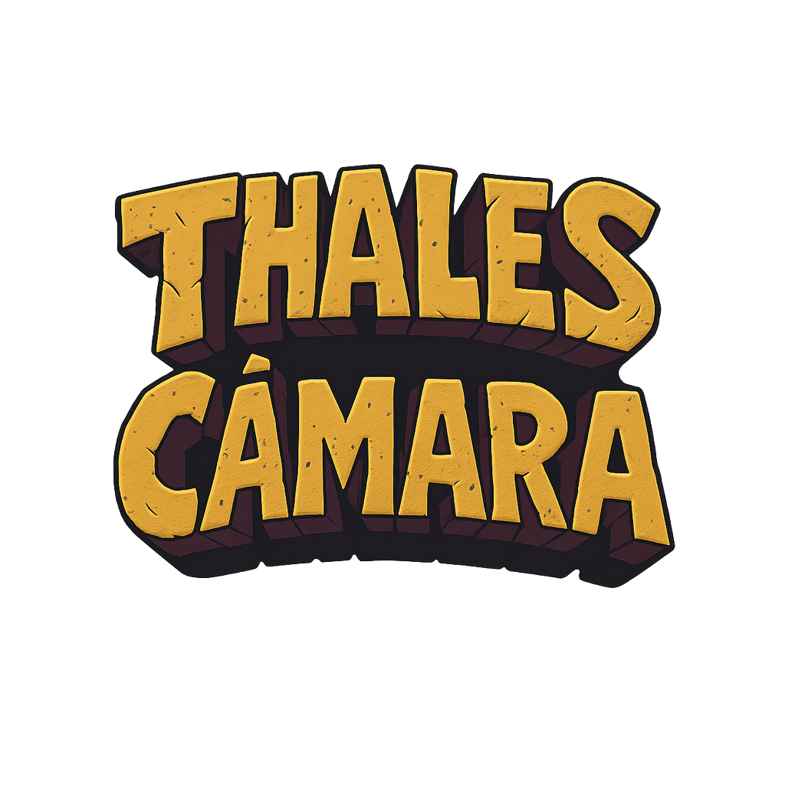
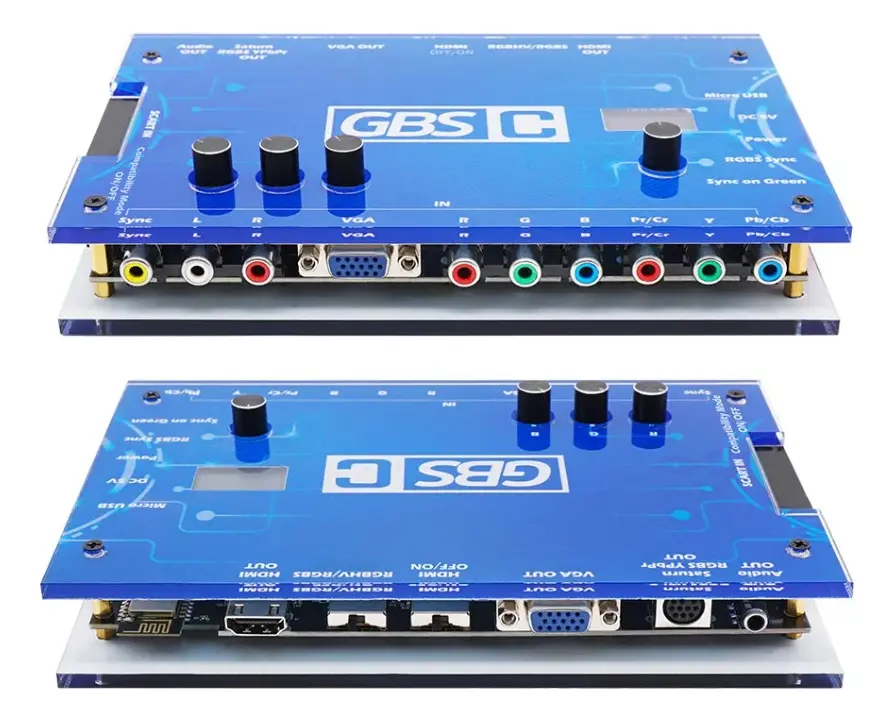
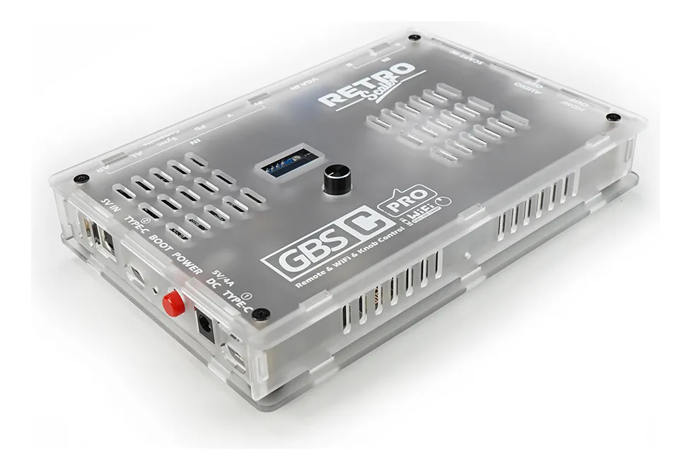

<!-- markdownlint-disable MD033 MD041 -->

  

  
  &nbsp;&nbsp;&nbsp;&nbsp;
  

  <b>GBS Control (Blue)</b>
  &nbsp;&nbsp;&nbsp;&nbsp;&nbsp;&nbsp;&nbsp;&nbsp;
  <b>GBSC Pro</b>

 

# GBS-Control Thales Câmara Edition

> _"Firmware do canal, pra galera."_

Custom firmware for the **GBS Control (Blue)** and **GBSC Pro** video upscalers, tailored for the [Thales Câmara YouTube channel](https://www.youtube.com/@thalescamara). Officially branded **GBS-Control Edição Thales Câmara** and available in two flavors: **Edição Azul** (Blue) and **Edição Pro**.

This project takes the excellent open-source firmware from the GBS Control community and adapts it with a full Brazilian Portuguese localization, curated presets for popular retro consoles, channel-themed UI colors, stability fixes and quality-of-life improvements aimed at the channel's audience, installable straight from the browser.

This is an independent, community customization with no official affiliation to RetroScaler or Brisma.

## Links

[Hotsite & web installer](http://thaleco.ludufre.com) | [Thales Câmara — YouTube](https://www.youtube.com/@thalescamara) | [GBS Control (upstream)](https://github.com/ramapcsx2/gbs-control) | [GBSC Pro (upstream)](https://github.com/RetroScaler/gbsc-pro)

## About the devices

**GBS Control (Blue)** and **GBSC Pro** are affordable open-source video upscalers based on the Tvia Trueview5725 chipset. Both convert analog video signals from retro gaming consoles and vintage computers into modern HDMI output with low latency, and both are controlled by an ESP8266 via a Wi-Fi Web UI.

- **GBS Control (Blue)** — entry-level board. HDMI output, supports RGBS, RGBHV and Component (YPbPr) inputs. Controlled via Web UI, with optional OLED menu (SSD1306 + rotary encoder add-on).
- **GBSC Pro** — premium board by RetroScaler. Adds **Composite (AV)** and **S-Video** inputs via the ADV7280 decoder, an **on-screen display (OSD)** on the output image, an **OLED menu** and **IR remote control** for configuration without needing a computer or phone.

## Features added by this fork

- **Brazilian Portuguese translation** across the Web UI, OLED menu and on-screen display (OSD).
- **Custom Web UI theme** with colors matching the Thales Câmara channel identity.
- **Curated presets** for popular consoles (NES, SNES, Mega Drive / Genesis, PlayStation, Saturn, Nintendo 64, and more) so users can get a great picture without manual tweaking.
- **Browser-based web installer** flash over USB straight from Chrome or Edge on desktop (via WebSerial).
- **OTA updates** — firmware can be updated over Wi-Fi directly from the Web UI.
- All upstream features remain available: motion-adaptive deinterlacer, ADC auto gain/offset, scanlines, BCSH controls, bypass modes, etc.

The Web UI is organized into five sections: **Profiles, Image, Filters, Config** and **System**.

## Installation

Installation runs entirely in the browser.

1. Connect the board to your computer with a USB **data** cable.
2. Open the web installer for your board:
   - **Edição Azul:** <http://thaleco.ludufre.com/flasher>
   - **Edição Pro:** <http://thaleco.ludufre.com/pro>
3. Select the serial port and wait roughly a minute for the flash to complete.
4. From then on, updates can be done wirelessly via OTA from the Web UI.

> The web installer requires **Chrome or Edge on desktop** (WebSerial is not supported by Safari, Firefox or mobile browsers). The initial web install may erase saved profiles (a checkbox controls this); OTA updates preserve them. You can revert to the original firmware at any time from the upstream repositories.

## Repository structure

This monorepo holds the customized source for both supported devices:

### [`blue/`](blue/) — GBS Control (Blue)

ESP8266-based firmware for the original blue GBS-8200 / GBS-8220 boards retrofitted with the GBS Control mod. Built with PlatformIO. Outputs HDMI up to 1600×1200; configuration is handled entirely through the Web UI.

### [`pro/`](pro/) — GBSC Pro

Firmware suite for the GBSC Pro board, organized as:

- `gbs-control/` — ESP8266 main controller (video scaler, OLED menu, IR, Web UI).
- `adv-controller/` — HC32F460 secondary controller for the ADV7280 decoder and ADV7391 encoder.
- `adv-manager/` — Python desktop GUI for debugging ADV register settings over serial.
- `gbsc-pro-flasher/` — cross-platform GUI/CLI flashing tool (Windows, macOS, Linux).
- `hardware/` — PCB design files, BOM and datasheets.

Each subdirectory keeps its own `README.md` with build instructions and component-specific details.

## Supported sources

NTSC and PAL standards, EDTV/HD formats, and VGA modes from 192p up to 1600×1200. Works with virtually any analog source — 8-bit and 16/32-bit consoles, 2000s-era consoles, home computers and early PCs, including unusual modes such as the PlayStation 2 VGA-over-Component output. The GBSC Pro additionally accepts Composite and S-Video sources through its ADV7280 decoder.

## References

### GBS Control (Blue)

- <https://github.com/RetroScaler/GBSC> — hardware
- <https://github.com/ramapcsx2/gbs-control> — upstream firmware
- <https://ramapcsx2.github.io/gbs-control/> — official documentation

### GBSC Pro

- <https://github.com/RetroScaler/gbsc-pro> — hardware and firmware
- <https://github.com/Brisma/gbsc-pro> — firmware fork by Brisma

### Community

- [GBS Control Discord](https://discord.com/invite/2MMWRkVRbk)
- [RetroRGB overview video](https://www.youtube.com/watch?v=fmfR0XI5czI) by Bob
- [Thales Câmara YouTube channel](https://www.youtube.com/@thalescamara/search?query=GBS) — Brazilian Portuguese content focused on retro gaming and hardware.

## License

Each subproject keeps the license inherited from its upstream source. See `blue/LICENSE` and `pro/LICENSE` for details.

## Thanks

Huge thanks to the developers and maintainers of the original firmware and hardware, and to the community that keeps these projects alive:

[@ramapcsx2](https://github.com/ramapcsx2), [@RetroScaler](https://github.com/RetroScaler), [@Brisma](https://github.com/Brisma), and all the contributors to the upstream `gbs-control` and `gbsc-pro` projects — alongside earlier work by dooklink, mybook4, Ian Stedman and others.

And of course, thanks to [Thales Câmara](https://www.youtube.com/@thalescamara) and the channel's community for supporting this customization effort.

## Credits

Firmware customization and engineering by [Luan Freitas (@ludufre)](https://github.com/ludufre); curation and channel identity by [Thales Câmara](https://www.youtube.com/@thalescamara).
